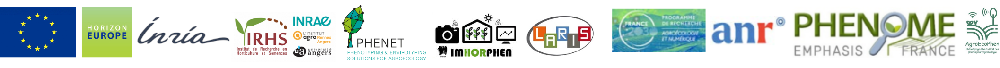

<!-- # FrontVeg-V2: A Semantic-Geometric Fusion Pipeline for Precision Phenotyping -->
<!-- <p align="center"> -->
<!-- <p align="center">
     
</p> -->
# FrontVeg-V2: A Semantic-Geometric Fusion Pipeline


[](https://www.napari-hub.org/plugins/napari-frontveg)
[](https://www.python.org/downloads/)
[](https://opensource.org/licenses/MIT)

We present **FrontVeg V2**, a high-precision computer vision pipeline designed for automated phenotyping in **viticulture** and **arboriculture**. By fusing **monocular depth estimation** with **vision-language segmentation priors (SAM3)**, it isolates the foreground canopy from cluttered agricultural backgrounds, enabling accurate leaf area estimation and fruit counting.


## Key Features

* **Geometric-Semantic Fusion:** Uses depth-anything-v2 to filter out background rows, solving the "background noise" problem in dense orchards.
* **Zero-Shot Adaptation:** Prompt-based segmentation (e.g., "leaf", "grapes", "diseased") without re-training.
* **Dual-Interface:** * **CLI Mode:** Batch processing for large-scale datasets.
    * **Napari Plugin:** Interactive "Human-in-the-loop" interface. 
* **Advanced Phenotyping:** Automated calculation of **Total Area**, **Instance Count**, **Mean Size**, and **Standard Deviation** (exported via CSV).
* **Efficiency**: Works with side-view RGB images. 
**Perspective:** Can also serve as manual annotation interface, withch can reduces annotation time from ~20 minutes to ~170 seconds per image.

 

### Version Evolution: From V1 to V2

Building upon the foundations of its predecessor, **FrontVeg V2** represents a significant leap in both performance and architectural efficiency. It significantly outperforms **FrontVeg V1** in individual instance segmentation while drastically reducing pipeline complexity.

Key improvements include:

* **Unified Foundation Model:** Unlike the fragmented approach of V1, V2 leverages a single, robust foundation model **(SAM3)** for all semantic tasks, ensuring better feature consistency.

* **High-Resolution Tiling:** Integration of a sophisticated **sliding window inference** strategy allows the model to maintain surgical precision on high-resolution agricultural imagery without memory overflow.

* **Advanced Instance Separation:** By employing **graph-based clustering** for connected component analysis, V2 excels at separating overlapping leaves and dense fruit clusters, providing a granular level of detail previously unattainable.


| Perspective | FrontVeg V1 | FrontVeg V2 |
| :--- | :---: | :---: |
| **RGB** |  |  |
| **Overlay**  |  |  |
| **Final Mask** |  |  |
---

## 🛠 The 3-Step Pipeline

The core innovation of FrontVeg is its hierarchical filtering approach:

1.  **Geometric Filtering (Foreground):**
    * $RGB \rightarrow \text{Depth-Anything V2} \rightarrow \text{Depth Map}$.
    * Statistical histogram analysis to find the optimal threshold based on the deepest valley.
    * Result: A binary mask isolating the foreground vegetation (removing background rows).
2.  **Semantic Segmentation:**
    * $RGB + \text{Text Prompt} \rightarrow \text{SAM3} \rightarrow \text{Semantic Candidates}$.
    * Identifies specific organs (leaves, fruits) based on linguistic context.
3.  **Logical Fusion (ROI Extraction):**
    * A logical `AND` operation between the **Foreground Mask** and the **Semantic Mask**.
    * Result: Clean, instance-level segmentation of the objects of interest in the primary row.

---

## 📂 Project Structure

```text
.
├── checkpoints/              # Model weights (Depth-Anything-V2, SAM3)
├── src/
│   ├── frontveg/             # Core logic and processing engines
│   └── napari_frontveg/      # Napari plugin implementation
├── external/                 # Submodules (Depth-Anything-V2, SAM3)
├── main_final.py             # CLI Entry point for batch processing
└── setup.cfg                 # Package configuration
```

---

## 🚀 Installation

### 1. Clone
```bash
git clone https://github.com/djaliloh/FrontVeg.git  
cd FrontVeg
```

### 2. Environment Setup
```bash
conda create -n frontveg python=3.10
conda activate frontveg
pip install torch torchvision torchaudio --index-url https://download.pytorch.org/whl/cu121
pip install -e .
```

### 3. Checkpoints
Ensure models weights are placed in the `checkpoints/` directory:
* `depth_anything_v2_vitl.pth`
* `sam3.pt`

### 4. Clone Submodules
Ensure DepthAnything V2 and SAM3 are placed in the `external/` directory:
* `Depth-Anything-V2`
```bash
git clone https://github.com/DepthAnything/Depth-Anything-V2.git
cd Depth-Anything-V2
pip install -r requirements.txt
```
* `sam3`
```bash
git clone https://github.com/facebookresearch/sam3.git
cd sam3
pip install -e .
```


---

## 🖥 Usage

### Napari Plugin (Interactive)
Designed for researchers needing to validate results or generate Ground Truth data.
1. Launch Napari: `napari`
2. Open an image.
3. Use the **FrontVeg Widget (FrontVeg Studio)** to select your `Prompt` (e.g., "leaf) and adjust `Tile_overlap`, `Sigma`, `Peak_dist`,  `Auto_save`.
4. Click **Run Complete Pipeline**.
5. Export results and stats directly to `.csv` and/or `.png`.

### CLI (Batch Processing)
For large-scale agricultural analysis:
```bash
python main_final.py --input ./data/vineyard --output ./results  --peak_dist 8 --sigma 1.1 --smoothed --prompt "leaf" --sam3_ckpt ./checkpoints/sam3_ckpts/sam3.pt 
```

---

## 📊 Phenotyping Metrics
The pipeline provides statistical outputs:
* **Instance Count:** Number of individual leaves or fruits.
* **Projected Leaf Area:** Sum of pixels belonging to the vegetation mask.
* **Morphological Distribution:** median, Mean and Standard Deviation of object sizes to assess crop uniformity and vigor.

---

## 📄 Citing FrontVeg V2
If you use this work for your research, please cite our ECCV paper:
```bibtex
@inproceedings{adjalil2026frontveg,
  title={FrontVeg-SAM3: Foreground-Aware Zero-Shot Plant Trait Segmentation in Trellised Crops Using
Side View Monocular RGB Images},
  author={A-D. Ousseini Hamza, et al.}, 
  booktitle={Proceedings of the European Conference on Computer Vision (ECCV)}, 
  year={2026}
}
```
<!--  -->

## Contact
- Abdoul Djalil Ousseini Hamza - Engineer, [abdoul-djalil.ousseini-hamza@inrae.fr]
- Herearii Metuarea - PhD student, [herearii.metuarea@univ-angers.fr]
- Corentin Lothode - Researcher Engineer, [corentin.lothode@inrae.fr]
- David Rousseau - Professor, [david.rousseau@univ-angers.fr]

<!-- --- -->
<!-- **Developed for the future of Digital Viticulture.** 🍷 🍎 -->


<!-- # Foreground Mask Extraction In Row Crop Images

This repository provides a simple pipeline to extract the **foreground mask** from **row crop RGB** images using depth estimation and histogram-based thresholding.

---

## Pipeline Overview

0. **Foreground Mask Extraction**

   * We use [Depth-Anything V2](https://github.com/DepthAnything/Depth-Anything-V2) to generate depth maps from RGB images.
   * From the generated depth maps, we apply the following steps:

     1. **Histogram Computation** – compute the depth histogram for each map.
     2. **Valley Detection** – identify the minima (valleys) between significant modes in the histogram.
     3. **Thresholding** – select the optimal threshold based on the valley position and binarize the depth map.
     4. **Mask Generation** – the resulting binary mask separates the **foreground** from the **background**.


## To run the code


1. **Clone our repository [FrontVeg](https://github.com/djaliloh/FrontVeg.git)**
    
    * Step 1:
        1. clone :  <pre> git clone https://github.com/djaliloh/[FrontVeg](https://github.com/djaliloh/FrontVeg.git) </pre>
        2. <pre> cd FrontVeg </pre>

2. **Depth Estimation**

   * Step 2:
     1. Clone the official repository : <pre> git clone https://github.com/DepthAnything/Depth-Anything-V2.git </pre>
     2. Download the pre-trained weights (we use the `vitl` model).

3. **Run the script**
    * Step 3:
        1. Specify your data path in "run_fgvegseg_pipline.sh" file
        2. <pre> bash run_fgvegseg_pipline.sh </pre>


---

## Summary of What the Code Does

* Takes an RGB image.
* Estimates its depth map using Depth-Anything V2.
* Analyzes the histogram of the depth map to detect valleys (local minima).
* Selects the best threshold based on these minima.
* Generates a clean **foreground mask**.
--- -->

<!-- ## 👤 Authors

- **Abdoul Djalil OUSSEINI H.** – Initial work & implementation 
- **Herearii MOUTERA** – Contribute to the initial work 
- **David ROUSSEAU** – Contribute to the initial work  -->


<!-- --- -->

